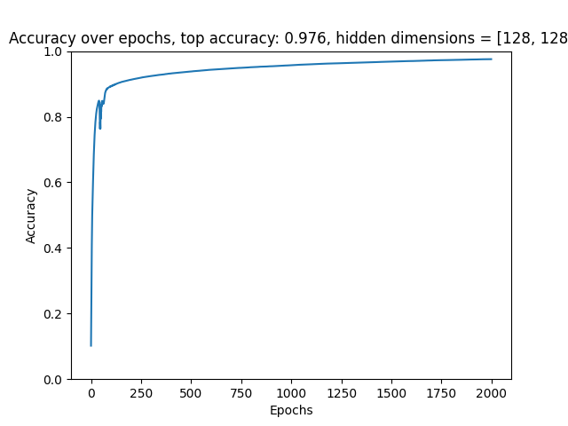

## Neural Network

A small-scale neural network implemented in Python

## Installation

Get the [mnist](https://yann.lecun.com/exdb/mnist/) database files to train with and extract them into `data` folder in project root or anywhere else, just make sure that the file location parameters in `main.py` correspond with the locations of files on disk. Install dependencies with:
```
pip install -r requirements.txt
```
Then run `python main.py train` to see the neural network in action. Make adjustments to the `hidden_layer_dims`, `epochs` and `learning_rate` to see how the neural network reacts to parameter adjustion. To see the full list of configuration options, run `python main.py train --help`

## Results

### Simple Neural Network model

Adjusting hidden layer dimensions gives varying levels of accuracy with the trade-off of increased running time.

|Epochs|Learning rate|Hidden Layer dimensions|KFolds|Training Accuracy|Test Accuracy|Running time|
| --- | --- | --- | --- | --- | --- | --- |
| 1000 | 0.05 | 16 x 16 | 1 | 96.9% | 95.7% | 2min 3s |
| 1000 | 0.05 | 32 x 32 | 1 | 96.9% | 95.7% | 2min 19s |
| 1000 | 0.05 | 64 x 64 | 1 | 97.7% | 96.2% | 2min 49s |
| 1000 | 0.1 | 64 x 64 | 1 | 97.2% | 95.6% | 2min 51s |
| 1000 | 0.05 | 128 x 128 | 1 | 99.05% | 97.4% | 4min 10s |
| 1500 | 0.05 | 128 x 128 | 1 | 99.64% | 97.5% | 6min 16s |
| 2000 | 0.01 | 128 x 128 | 1 | 97.65% | 96.3% | 7min 57s |
| 1000 | 0.05 | 256 x 256 | 1 | 99.67% | 97.6% | 6min 35s |

Plotting the development of the accuracy over the epochs yields for example:



The plot is built from the following table entry:
|Epochs|Learning rate|Hidden Layer dimensions|KFolds|Training Accuracy|Test Accuracy|Running time|
| --- | --- | --- | --- | --- | --- | --- |
| 2000 | 0.01 | 128 x 128 | 1 | 97.65% | 96.3% | 7min 57s |

Results give the model an approximated maximal testing accuracy of around 97.7%. **Note**: results aren't proper benchmarks and all have a sample size of **1**.

### Convolutional Neural Network model

|Epochs|Learning rate|KFolds|Training accuracy|Test accuracy|Running time|
| --- | --- | --- | --- | --- | --- |
| 20 | 0.01 | 5 | 99.9% | 98.7% | 2 min 29s |
| 30 | 0.005 | 3 | 99.9% | 98.7% | 1 min 55s |
| 50 | 0.005 | 5 | 99.9% | 98.8% | 6 min 19s |

Convolutional neural network provides better performance and higher accuracy than the simpler neural network that does not leverage filtering.

All results were computed with following computer specs and Python 3.12:
```
CPU: AMD Ryzen 7 7800x3D
GPU: RTX 4070 Ti
RAM: 32Gb 6000Mhz
```

## Running the flask server

A minimalistic flask server is provided in the `server.py` file. To run the flask server run the following command:

```
flask --app server run
```

Afterwards posting a 28x28 grid data within a json to `http://localhost:5000` will cause the server to predict the output with the neural network and returns a single value representing the prediction and the confidence of the prediction. This is used in conjuction with my [personal website](https://github.com/Anttonii/personal-website) project.
